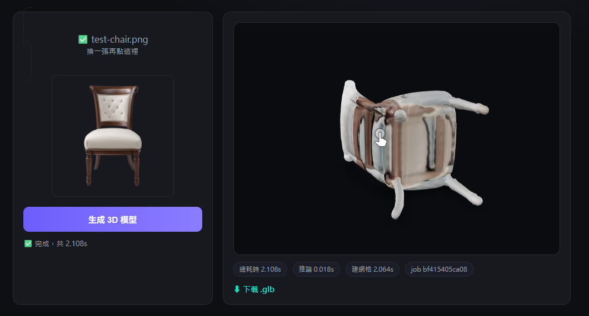

# Bob 3D — 上傳一張圖或打幾個字，本機 GPU 幾秒生 3D 模型

自架版的 [Meshy](https://www.meshy.ai)：**上傳一張圖**，或**打一段文字**，用開源模型在**自己的 GPU** 上幾秒鐘重建出可旋轉、可下載的 3D 模型（`.glb`）。不呼叫任何雲端 API、不上傳圖片到外部、跑幾張都不花錢。

- **圖生 3D**：[TripoSR](https://github.com/VAST-AI-Research/TripoSR) 單圖前饋重建。
- **文字生 3D**：先用 [SDXL-Turbo](https://huggingface.co/stabilityai/sdxl-turbo) 把文字生成一張圖，再走同一條 TripoSR 管線轉 3D。



上圖是實測：左邊上傳一張椅子照片，右邊約 2 秒後就渲染出帶顏色、可用滑鼠旋轉的 3D 椅子。

## 它做得到什麼

- **單圖生 3D**：一張 2D 圖 → 一個帶頂點色的 3D mesh，前端可即時旋轉、縮放。
- **打字生 3D**：輸入一段英文描述（如 `a cute orange teapot`）→ SDXL-Turbo 秒生一張圖 → 同一條管線轉 3D。RTX 4070 實測全鏈路約 7 秒（生圖 ~2s + 推論 + 建網格 ~4.5s）。
- **快**：TripoSR **啟動時載入一次、常駐 GPU**，之後每次生成只花約 2~3 秒（RTX 4070 實測：推論 ~1s、建網格 ~1.5s）。這是體感接近 Meshy 的關鍵——不是每次請求都重載模型。
- **可下載**：直接下載 `.glb`，丟進 Blender / Unity / 任何吃 glTF 的工具。
- **全本機**：TripoSR（MIT）與 SDXL-Turbo 的權重與推論都在自己機器上，圖片與文字都不出門。

## 架構：殼 + 引擎分離

```
meshy-clone/            ← 這個 repo（殼）
├── backend/app.py      ← FastAPI，包住 TripoSR：收圖 → 去背 → 推論 → marching cubes → 匯出 .glb
├── frontend/index.html ← 單檔前端，用 Google <model-viewer> 顯示 .glb
└── start.ps1           ← 一鍵起前後端

meshy-clone-engine/     ← TripoSR 開源 repo（引擎，另外 clone，不 fork 進來）
```

引擎（TripoSR 本體）刻意跟殼分開放，透過環境變數 `TRIPOSR_DIR` 掛進來，升級或換引擎時殼不用動。

### 文字生 3D 的 VRAM 讓渡（12GB 卡的重點）

TripoSR 常駐約 5GB，SDXL-Turbo 光載入就吃約 7GB、峰值 8GB——兩個同時擺 GPU 會爆掉 12GB。所以打字生 3D 時：SDXL-Turbo **lazy 載入**（第一次打字才載）、生完圖立刻把權重移回 CPU 並 `torch.cuda.empty_cache()`，把 VRAM 讓回給常駐的 TripoSR 做推論。代價是 SDXL 每次要在 CPU↔GPU 間搬一趟（幾秒），換來單張 12GB 卡塞得下兩個模型。

### 一次請求的流程

1. **去背 + 置中**（`rembg`）：先把主體從背景摳出來、置中，重建品質差很多。
2. **推論**：圖 → scene codes（TripoSR 的 transformer，一次前饋，不是 diffusion 迭代，所以快）。
3. **marching cubes 出 mesh**：從 scene codes 抽等值面成三角網格，帶頂點色。
4. **匯出 `.glb`**：trimesh 匯出 glTF binary，前端 `<model-viewer>` 直接讀。

## 前置需求

- **NVIDIA GPU**（實測 RTX 4070 / 12GB；TripoSR 約需 5~6GB VRAM，打字生 3D 時 SDXL-Turbo 峰值再吃約 8GB，靠 VRAM 讓渡輪流用同一張卡）。
- **Python 3.10+**、[uv](https://github.com/astral-sh/uv)（管虛擬環境）。
- Windows / Linux 皆可（本專案在 Windows 11 上開發，特意避開需要 MSVC 編譯的相依）。
- **不需要**本機裝 CUDA toolkit 或 nvcc——用 PyTorch 的 cu121 預編 wheel，CUDA runtime 自帶。

## 安裝

```bash
# 1) clone TripoSR 引擎（跟本 repo 平行放）
git clone https://github.com/VAST-AI-Research/TripoSR.git meshy-clone-engine
cd meshy-clone-engine
uv venv

# 2) 裝 PyTorch（cu121 預編 wheel，自帶 CUDA runtime）
uv pip install --python .venv/Scripts/python.exe torch --index-url https://download.pytorch.org/whl/cu121

# 3) 裝 TripoSR 相依（見下方「Windows 踩坑」關於 torchmcubes 的替換）
uv pip install --python .venv/Scripts/python.exe -r requirements.txt
uv pip install --python .venv/Scripts/python.exe "rembg[cpu]" onnxruntime fastapi uvicorn python-multipart

# 4) 打字生 3D 需要 diffusers（版本要卡死，見下方「Windows 踩坑」）
uv pip install --python .venv/Scripts/python.exe \
  "diffusers==0.27.2" "huggingface-hub==0.25.2" accelerate
```

## 啟動

```powershell
# 在 meshy-clone 目錄下
.\start.ps1
```

會起兩個服務並自動開瀏覽器：

- 前端：<http://127.0.0.1:5173>
- 後端 health：<http://127.0.0.1:8000/api/health>

後端第一次啟動要載模型（約 10~20 秒），`health` 回 `loading` 是正常的，變 `ok` 後就能用：

```json
{"status":"ok","device":"cuda:0","gpu":"NVIDIA GeForce RTX 4070","mc_resolution":256}
```

## API

`POST /api/generate`（multipart，欄位 `image`）：

```bash
curl -X POST http://127.0.0.1:8000/api/generate -F "image=@chair.png"
```

回傳：

```json
{
  "job_id": "174a1103d4c3",
  "model_url": "/outputs/174a1103d4c3/model.glb",
  "input_url": "/outputs/174a1103d4c3/input.png",
  "timings_sec": {"preprocess":0.019,"inference":0.943,"mesh":1.475,"export":0.009},
  "total_sec": 2.446
}
```

`POST /api/generate-from-text`（multipart，欄位 `prompt`）：

```bash
curl -X POST http://127.0.0.1:8000/api/generate-from-text \
  -F "prompt=a cute orange teapot, clean studio background, single object, centered"
```

回傳同上，多一個 `text2img` 耗時、外加一張 `generated.png`（SDXL 生的中間圖）：

```json
{
  "job_id": "a1d77bcb6925",
  "model_url": "/outputs/a1d77bcb6925/model.glb",
  "timings_sec": {"text2img":1.917,"preprocess":0.2,"inference":0.021,"mesh":4.554,"export":0.008},
  "total_sec": 6.681
}
```

## 限制（誠實說）

- **背面會糊**：TripoSR 是**單圖**重建，模型看不到的那一面靠猜，椅腳、背面常有融化感或破面。要乾淨全貌得多視角輸入的模型（成本更高、VRAM 更吃）。
- **無貼圖 atlas**：這裡用頂點色（快、省 VRAM），不是烘焙 UV 貼圖。要高品質貼圖得另跑 `--bake-texture`（需 `moderngl`）。
- **主體要單純**：單一主體、背景乾淨的圖效果最好；多物件、複雜場景會亂。
- **打字生 3D 靠中間圖決定品質**：文字先生一張 2D 圖，再由那張圖重建 3D。所以 SDXL 生的圖歪、非置中、背景雜，3D 就跟著糊。英文、描述單一物體、加 `single object, centered` 效果最穩。

## Windows 踩坑

- **`torchmcubes` 裝不起來**：它需要 MSVC 編譯，很多 Windows 機器沒有。本專案把引擎的 `tsr/models/isosurface.py` 改用純 Python 的 `scikit-image` marching cubes 頂替（介面對齊），完全免編譯。
- **uv venv 沒有 pip**：別用 `python -m pip`，一律 `uv pip install --python .venv/Scripts/python.exe ...`。
- **trimesh 匯出 glb 報 `'numpy.ndarray' has no attribute 'ptp'`**：numpy 2.x 移除了 `ptp()`，升 `trimesh>=4.12` 即可。
- **rembg 報 `No onnxruntime backend found`**：裝 `rembg[cpu]` + `onnxruntime`。
- **diffusers 版本地獄（打字生 3D）**：要同時滿足 diffusers、TripoSR、torch 2.4.1 三方，版本要卡死成 `diffusers==0.27.2` + `huggingface-hub==0.25.2`。三個坑：新版 diffusers（0.39）跟 torch 2.4.1 的 custom-op 註冊衝突（`unsupported type torch.Tensor`）；diffusers 0.27 要 `cached_download`，但 hf-hub ≥0.26 已移除，故 hf-hub 必須 ≤0.25.2；裝 diffusers 常順手把 hf-hub 升到 1.x 反過來又不相容——裝完務必 `pip show huggingface-hub` 確認還是 0.25.2。

## 授權

殼（本 repo）自由使用。引擎 TripoSR 為 MIT 授權（stabilityai/TripoSR）；文字生圖用 SDXL-Turbo（stabilityai/sdxl-turbo，其自有授權，商用前請自行確認）。
